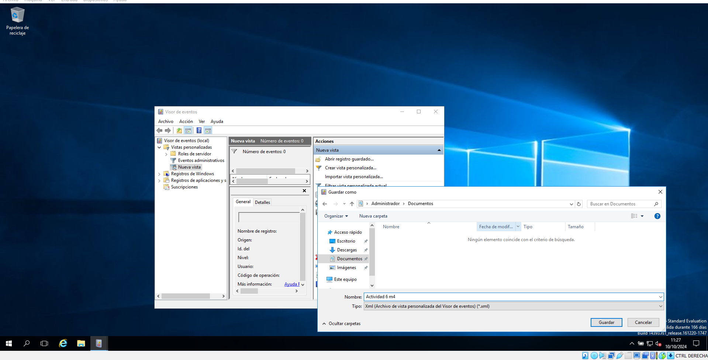

# Guia per a la Gestió d'Esdeveniments a Windows

## 1. Crear una vista personalitzada
Pas 1: Obre el Visor d'esdeveniments
                
                Pas 2: Fes clic en Visions personalitzades i crea una nova vista personalitzada
                
                Pas 3: Defineix els criteris de filtratge i al aceptar, es desa la vista personalitzada
                   
               Pas 1: Obrir el Programador de tasques
                
                Pas 2: Fer clic a "Crear tasca"
                
                Pas 3: Configurar les opcions de la tasca, estableix els desencadenants i es desa la tasca
                
        3. Exportar una vista personalitzada a un fitxer XML</h2>
                Pas 1: Fer clic amb el botó dret i seleccionar "Exportar"
                
               Pas 2: Confirma l'exportació i seleccionar la ubicació de desament on vulgis (en el nostre cas ho vam guardar en Descarges)
                
          4. Importar la vista personalitzada des d'una altra màquina virtual (MV)</h2>
      Pas 1: Fer clic a "Importar vista"
                
            </li>
            <li>
                <h3>Pas 2: Seleccionar el fitxer XML a importar i confirmes la importació</h3>
                
            </li>
        </ol>
    

    

        <h2>5. Esdeveniments rellevants a Windows</h2>
        <ul>
            <li><strong>1. Quin esdeveniment succeeix quan s'inicia Windows?</strong> Inici de Windows: Es registra un esdeveniment d'inici en el registre d'esdeveniments.</li>
            <li><strong>2. Quin esdeveniment succeeix quan s'apaga Windows?</strong> Apagat de Windows: Es registra un esdeveniment d'apagat en el registre d'esdeveniments.</li>
            <li><strong>3. Quin esdeveniment succeeix quan es crea un compte d'usuari?</strong> Creació d'un compte d'usuari: Es registra un esdeveniment de creació de compte en el registre d'esdeveniments.</li>
            <li><strong>4. Quin esdeveniment succeeix quan un usuari falla un login?</strong> Fallo d'inici de sessió: Es registra un esdeveniment de fallo
            <li><strong>5. Quin esdeveniment succeeix quan un usuari canvia l'hora del SO?</strong> Canvi d'hora del sistema operatiu: Es registra un esdeveniment de canvi d'hora en el registre d'esdeveniments.</li>

